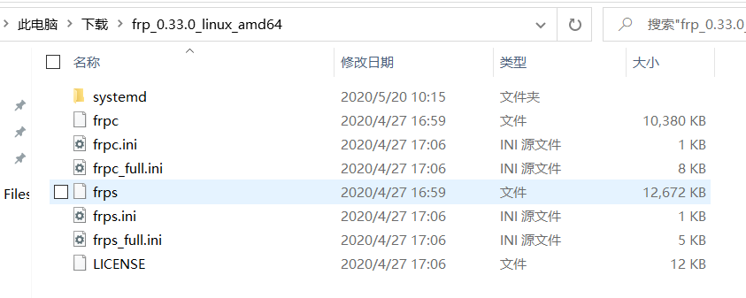

## 简介

frp是一个使用简单，功能较多，免费且开源的内网穿透工具。支持tcp,udp协议。

最新版本里有对点对点穿透的支持。


## 官方文档

官方文档非常详细，如果你想详细了解使用和学习，请直接前往官方文档地址。如果只是想快速上手使用，则可以继续往下看。

<a href="https://github.com/fatedier/frp/blob/master/README_zh.md" target="_blank">https://github.com/fatedier/frp/blob/master/README_zh.md</a>

## 下载

<a href="https://github.com/fatedier/frp/releases" target="_blank">https://github.com/fatedier/frp/releases</a>

直到我写这篇博客时，官方还没有对不同版本的客户端和服务端做兼容，请保证所使用的为同一版本。当然，不同平台是兼容的。

下载解压后如图中所示：



我们需要关注的文件`frpc`：客户端可执行文件，`frpc.ini`：客户端配置文件，`frps`：服务端可执行文件，`frps.ini`：服务端配置文件。

## 配置文件

`frps.ini`：

```ini
[common]
#服务端与客户端通讯的端口
bind_port = 7000 
#服务端暴露的web端口
vhost_http_port = 80 
#客户端身份验证方式，这里我们选择token
authentication_method = token 
#token的值,随意填写但需要保证客户端与服务端一致
section = sdfhfuiefah34hruef 

```

`frpc.ini`：

```ini
[common]
#服务器端的主机地址
server_addr = *.*.*.*
#服务器的bind_port
server_port = 7000 
#客户端身份验证方式，
authentication_method = token
#token的值
section = sdfhfuiefah34hruef 

#It just a name.本个端口映射的名字 我们这一条是转发了一个MySQL的连接端口
[mysql1] 
#数据协议
type = tcp 
#本地 需要转发的主机 ip
local_ip = *.*.*.* 
# 本地 需要转发的端口号
local_port = 3307 
# 映射到服务端的端口号
remote_port = 3307 

#这里转发了一个web端口
[web] 
type = http
local_port = 80
#web转发必填，有域名可填域名(必须已备案)，没有就填 服务端ip，访问使用ip:vhost_http_port
custom_domains = *.*.*.*

#这一条转发了ssh端口
[ssh_master] 
type = tcp
local_ip = *.*.*.*
local_port = 22
remote_port = 6000
```


## 启动Frp

### Linux

1.Linux 下需要对文件先赋权

2.启动frps

`chmod +X frps`,

`./frps -c ./frps.ini`

3.启动 frpc：

`chmod +X frpc`

`./frpc -c ./frpc.ini`


至此，已经可以开始使用了。

## 其他

### Systemctl

以`./frpc -c ./frpc.ini`这种方式启动的服务是前台运行的，自然不够方便。我们可以利用Systemctl来将frp注册为服务，后台启动和开机自启.

1.创建文件

`sudo vim /lib/systemd/system/frps.service`

2.在文件里写入，以下内容

```
[Unit]
#填写所对应的frps service或者fprc service
Description=frps service 
After=network.target syslog.target
Wants=network.target

[Service]
Type=simple
#启动服务的命令（此处your.path写你的frps或者frpc的实际安装目录）
ExecStart=/your/path/frps -c /your/path/frps.ini

[Install]
WantedBy=multi-user.target
```

3.启动服务

`sudo systemctl start frps`

4.打开自启动

`sudo systemctl enable frps`

- 如果要重启应用，可以这样，`sudo systemctl restart frps`
- 如果要停止应用，可以输入，`sudo systemctl stop frps`
- 如果要查看应用的日志，可以输入，`sudo systemctl status frps`
- 有了后台运行和自启动`frp`就可以比较舒适的使用了。
